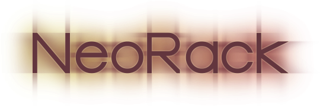

# NeoRack
[](SPEC.md)

[Rack](https://github.com/rack/rack) is great and I love all it's done for Ruby. It made us all stronger, gave us a unified platform and saved us countless developer hours and time.

However, Rack's design is showing its age... its CGI model has shortcomings that we can all sort of mitigate and code around, but cost us developer hours and often leave us with degraded performance.

The NeoRack specification is designed to offer a solution for these shortcomings by:

* Making long-polling, streaming and long requests first class citizens.

* Supporting server feature testing during startup and application buildup (in addition to during response execution).

* Supporting server extensions that can be implemented by either the server or external gems.

* Supporting (optional) backwards compatibility with Rack.

My hope is that one day NeoRack and Rack could be merged in a way that makes developers happy and advanced web applications easy to author.

Please read the [NeoRack specifications](SPEC.md) for details.

---

# The NeoRack Gem

Currently the gem is mostly a placeholder for a gem that will slowly fill up with common helpers.

## Installation

Add this line to your application's Gemfile:

```ruby
gem 'neorack'
```

And then execute:

    $ bundle install

Or install it yourself as:

    $ gem install neorack

## Usage

The only available module at the moment is the `NeoRack::Builder` that loads script files, offering them the DSL listed in the [NeoRack specifications](SPEC.md#neorack-application-scripts).

## Contributing

Bug reports and pull requests are welcome on GitHub at https://github.com/boazsegev/neorack. This project is intended to be a safe, welcoming space for collaboration, and contributors are expected to adhere to the [code of conduct](https://github.com/boazsegev/neorack/blob/master/CODE_OF_CONDUCT.md).

## License

The gem is available as open source under the terms of the [MIT License](https://opensource.org/licenses/MIT).

## Code of Conduct

Everyone interacting in the NeoRack project's codebases, issue trackers, chat rooms and mailing lists is expected to follow the [code of conduct](https://github.com/boazsegev/neorack/blob/master/CODE_OF_CONDUCT.md).
