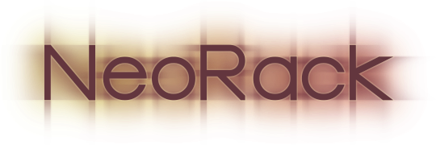

# NeoRack Extensions

The specifications listed in this folder are optional.

Servers **MAY** implement some or none.

Extensions could probably be implemented externally using mixins and/or middleware, except for `hijack` which NeoRack Servers are encouraged to implement and NeoRack Applications are encouraged to avoid.
